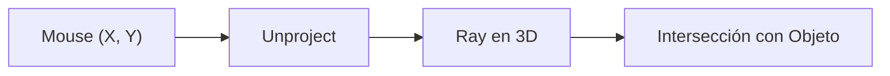
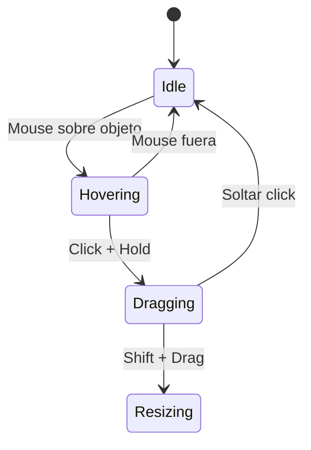

# Tutorial: Drag and Drop 3D en Yotsuba Hybrid

Este tutorial explica los **conceptos y técnicas** necesarios para implementar manipulación directa de objetos 3D con el mouse: seleccionar, arrastrar, y modificar propiedades (posición, tamaño) en tiempo real.

---

## 📌 Conceptos Fundamentales

### 1. El Problema: Pantalla 2D → Mundo 3D

El mouse opera en **coordenadas de pantalla (2D)**, pero los objetos viven en el **espacio 3D**. Necesitamos convertir entre ambos sistemas.



### 2. Ray Casting (Lanzamiento de Rayos)

Un **Ray** es una línea infinita con origen y dirección. Lo usamos para "disparar" desde la cámara hacia donde apunta el mouse.

```csharp
// Estructura básica de un Ray
public struct Ray
{
    public Vector3 Origin;      // Punto de inicio (posición de la cámara)
    public Vector3 Direction;   // Dirección normalizada
}
```

### 3. Bounding Box (Caja Envolvente)

Para detectar si el ray toca un objeto, usamos una **BoundingBox** (caja alineada a los ejes) que envuelve el objeto.

```csharp
// MonoGame ya incluye BoundingBox
BoundingBox box = new BoundingBox(
    center - size / 2,  // Esquina mínima
    center + size / 2   // Esquina máxima
);
```

---

## Paso 1: Crear un Ray desde la Posición del Mouse

### Concepto: Unproject

Convertir coordenadas de pantalla a mundo 3D usando las matrices View y Projection inversas.

```csharp
/// <summary>
/// Crea un Ray desde la posición del mouse hacia el mundo 3D.
/// Usar con: CameraComponent3D.ViewMatrix y CameraComponent3D.ProjectionMatrix
/// </summary>
public static Ray CreateRayFromMouse(Point mousePosition, Matrix view, Matrix projection, Viewport viewport)
{
    // 1. Normalizar posición del mouse a rango [-1, 1]
    // El punto cercano (Z=0) y lejano (Z=1) del frustum
    Vector3 nearPoint = new Vector3(mousePosition.X, mousePosition.Y, 0);
    Vector3 farPoint = new Vector3(mousePosition.X, mousePosition.Y, 1);

    // 2. Convertir de pantalla a mundo (Unproject)
    Vector3 nearWorld = viewport.Unproject(nearPoint, projection, view, Matrix.Identity);
    Vector3 farWorld = viewport.Unproject(farPoint, projection, view, Matrix.Identity);

    // 3. Calcular dirección del ray
    Vector3 direction = Vector3.Normalize(farWorld - nearWorld);

    return new Ray(nearWorld, direction);
}
```

> [!IMPORTANT]
> En Yotsuba Hybrid, puedes acceder al Viewport desde `YTBGlobalState.GraphicsDevice.Viewport`.

---

## Paso 2: Detectar Intersección con BoundingBox

MonoGame incluye el método `Ray.Intersects(BoundingBox)` que retorna la distancia al punto de intersección (o `null` si no hay colisión).

```csharp
/// <summary>
/// Verifica si un Ray toca una BoundingBox.
/// </summary>
/// <returns>Distancia al punto de impacto, o null si no hay colisión.</returns>
public float? CheckIntersection(Ray ray, Vector3 objectCenter, Vector3 objectSize)
{
    BoundingBox boundingBox = new BoundingBox(
        objectCenter - objectSize / 2,
        objectCenter + objectSize / 2
    );

    return ray.Intersects(boundingBox);
}
```

### Seleccionar el Objeto Más Cercano

Si hay múltiples objetos, selecciona el de menor distancia:

```csharp
public Object3D? SelectClosestObject(Ray ray, List<Object3D> objects)
{
    Object3D? closest = null;
    float minDistance = float.MaxValue;

    foreach (var obj in objects)
    {
        float? distance = CheckIntersection(ray, obj.Position, obj.Size);
        
        if (distance.HasValue && distance.Value < minDistance)
        {
            minDistance = distance.Value;
            closest = obj;
        }
    }

    return closest;
}
```

---

## Paso 3: Estados del Drag and Drop

El sistema necesita **estados** para manejar las diferentes fases:



### Implementación del Estado

```csharp
public enum DragState
{
    Idle,       // Sin interacción
    Hovering,   // Mouse sobre un objeto (cambiar cursor, highlight)
    Dragging,   // Arrastrando posición
    ResizingX,  // Modificando ancho
    ResizingY,  // Modificando altura
    ResizingZ   // Modificando profundidad
}

public class DragDropSystem
{
    private DragState _state = DragState.Idle;
    private Object3D? _selectedObject = null;
    private Vector3 _dragOffset;  // Offset entre mouse y centro del objeto
}
```

---

## Paso 4: Mover Objeto en un Plano

### Concepto: Plano de Arrastre

Al arrastrar, proyectamos el mouse sobre un **plano 3D**. Los más comunes son:

| Plano | Uso típico |
|-------|------------|
| XZ (Y constante) | Mover en el "suelo" |
| XY (Z constante) | Mover en plano vertical frontal |
| Paralelo a cámara | Mover siguiendo la vista |

### Intersección Ray-Plane

```csharp
/// <summary>
/// Calcula dónde un Ray intersecta un plano horizontal (Y constante).
/// </summary>
public Vector3? RayPlaneIntersection(Ray ray, float planeY)
{
    // Plano: todos los puntos donde Y = planeY
    // Ecuación: Origin.Y + t * Direction.Y = planeY
    
    if (Math.Abs(ray.Direction.Y) < 0.0001f)
        return null; // Ray paralelo al plano
    
    float t = (planeY - ray.Origin.Y) / ray.Direction.Y;
    
    if (t < 0)
        return null; // Intersección detrás de la cámara
    
    return ray.Origin + ray.Direction * t;
}
```

### Aplicar Movimiento

```csharp
public void UpdateDragging(MouseInfo mouse, CameraComponent3D camera)
{
    if (_state != DragState.Dragging || _selectedObject == null)
        return;

    // 1. Crear ray desde mouse actual
    Ray ray = CreateRayFromMouse(
        mouse.Position,
        camera.ViewMatrix,
        camera.ProjectionMatrix,
        YTBGlobalState.GraphicsDevice.Viewport
    );

    // 2. Encontrar intersección con el plano de arrastre
    Vector3? hitPoint = RayPlaneIntersection(ray, _selectedObject.Position.Y);

    if (hitPoint.HasValue)
    {
        // 3. Aplicar nueva posición (mantener el offset del click inicial)
        _selectedObject.Position = new Vector3(
            hitPoint.Value.X - _dragOffset.X,
            _selectedObject.Position.Y,
            hitPoint.Value.Z - _dragOffset.Z
        );
    }
}
```

---

## Paso 5: Redimensionar con el Mouse

### Concepto: Handles de Redimensionamiento

Los editores 3D usan "handles" (pequeños cubos o esferas en las esquinas/bordes) que el usuario puede arrastrar.

```
        ┌───[●]───┐
        │         │
       [●]   ■   [●]   ← Handles en bordes = Ancho/Alto
        │         │
        └───[●]───┘
```

### Calcular Nuevo Tamaño

```csharp
/// <summary>
/// Redimensiona un objeto basándose en el delta del mouse.
/// </summary>
public void UpdateResizing(MouseInfo mouse, CameraComponent3D camera)
{
    if (_state != DragState.ResizingX || _selectedObject == null)
        return;

    // Usar delta del mouse para modificar tamaño
    // Escalar apropiadamente según la distancia a la cámara
    float sensitivity = 0.01f;
    float deltaSize = mouse.XDelta * sensitivity;

    _selectedObject.Size = new Vector3(
        Math.Max(0.1f, _selectedObject.Size.X + deltaSize),  // Mínimo 0.1
        _selectedObject.Size.Y,
        _selectedObject.Size.Z
    );
}
```

---

## Paso 6: Loop Principal de Update

### Integrando Todo en Yotsuba Hybrid

```csharp
public void Update(GameTime gameTime)
{
    MouseInfo mouse = InputManager.Instance.Mouse;
    CameraComponent3D camera = EntityManager.Camera;

    // Crear Ray desde posición del mouse
    Ray ray = CreateRayFromMouse(
        mouse.Position,
        camera.ViewMatrix,
        camera.ProjectionMatrix,
        YTBGlobalState.GraphicsDevice.Viewport
    );

    switch (_state)
    {
        case DragState.Idle:
            // Buscar objeto bajo el mouse
            _hoveredObject = SelectClosestObject(ray, _objects);
            
            if (_hoveredObject != null)
                _state = DragState.Hovering;
            break;

        case DragState.Hovering:
            if (mouse.WasButtonJustPressed(MouseButton.Left))
            {
                _selectedObject = _hoveredObject;
                _state = DragState.Dragging;
                
                // Guardar offset para arrastre suave
                Vector3? hit = RayPlaneIntersection(ray, _selectedObject.Position.Y);
                if (hit.HasValue)
                    _dragOffset = hit.Value - _selectedObject.Position;
            }
            else if (SelectClosestObject(ray, _objects) == null)
            {
                _state = DragState.Idle;
            }
            break;

        case DragState.Dragging:
            if (mouse.IsButtonUp(MouseButton.Left))
            {
                _state = DragState.Idle;
            }
            else
            {
                UpdateDragging(mouse, camera);
            }
            break;
    }
}
```

---

## Paso 7: Feedback Visual

### Highlight del Objeto Seleccionado

Dibuja el objeto con un color diferente cuando está seleccionado:

```csharp
public void Draw(Graphics3D graphics, CameraComponent3D camera)
{
    foreach (var obj in _objects)
    {
        Color color = obj.BaseColor;
        
        // Cambiar color según estado
        if (obj == _selectedObject && _state == DragState.Dragging)
            color = Color.Yellow;
        else if (obj == _hoveredObject)
            color = Color.Lerp(obj.BaseColor, Color.White, 0.3f);

        graphics.DrawBox(
            obj.Position,
            obj.Size,
            color,
            camera.ViewMatrix,
            camera.ProjectionMatrix
        );
    }
}
```

### Opcional: Dibujar Outline/Wireframe

Puedes dibujar líneas alrededor del objeto seleccionado usando `PrimitiveType.LineList`.

---

## 📊 Resumen de Componentes Necesarios

| Componente | Ya existe en Yotsuba | Necesita crearse |
|------------|----------------------|------------------|
| `MouseInfo` | ✅ `YotsubaEngine/Input/MouseInfo.cs` | - |
| `CameraComponent3D` | ✅ `Camera.cs` | - |
| `Graphics3D` | ✅ `DrawBox`, `Draw3DRectangle` | - |
| `Ray` | ✅ (MonoGame.Framework) | - |
| `BoundingBox` | ✅ (MonoGame.Framework) | - |
| `RayCaster` (utilidad) | ❌ | Crear helper |
| `DragDropSystem` | ❌ | Crear sistema |
| `SelectableComponent` | ❌ | Crear componente |

---

## 💡 Mejoras Avanzadas

### 1. Snapping a Grid
```csharp
float gridSize = 1.0f;
position.X = MathF.Round(position.X / gridSize) * gridSize;
```

### 2. Undo/Redo
Guardar estados anteriores en una pila antes de cada modificación.

### 3. Gizmos de Transformación
Implementar flechas de ejes (RGB = XYZ) como en Unity/Blender.

### 4. Multi-selección
Usar `Shift+Click` para agregar a una lista de seleccionados.

---

## 🎮 Ejemplo de Uso Propuesto

```csharp
// En tu YTBProgram.cs o Game principal
public class EditorMode
{
    private DragDropSystem _dragDrop;
    private List<Object3D> _objects = new();

    public void Initialize()
    {
        _dragDrop = new DragDropSystem();
        
        // Crear algunos objetos de prueba
        _objects.Add(new Object3D 
        { 
            Position = Vector3.Zero, 
            Size = new Vector3(1, 1, 1),
            BaseColor = Color.Red 
        });
    }

    public void Update(GameTime gameTime)
    {
        _dragDrop.Update(gameTime, _objects);
    }

    public void Draw()
    {
        _dragDrop.Draw(graphics3D, camera);
    }
}
```

---

## 📚 Referencias

- [MonoGame Ray Documentation](https://docs.monogame.net/api/Microsoft.Xna.Framework.Ray.html)
- [Viewport.Unproject](https://docs.monogame.net/api/Microsoft.Xna.Framework.Graphics.Viewport.html#Microsoft_Xna_Framework_Graphics_Viewport_Unproject_Microsoft_Xna_Framework_Vector3_Microsoft_Xna_Framework_Matrix_Microsoft_Xna_Framework_Matrix_Microsoft_Xna_Framework_Matrix_)

---

> [!TIP]
> **Siguiente paso recomendado:** Crear una clase `RayCaster` en `YotsubaEngine/Core/YTBMath/` que encapsule la lógica de `CreateRayFromMouse` y `RayPlaneIntersection`.
