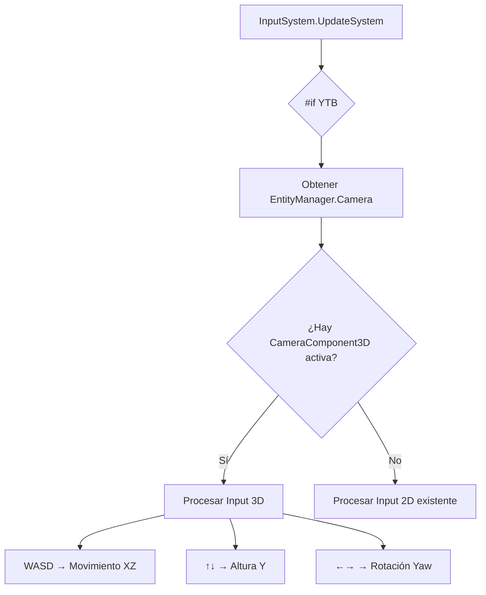

# Plan: Navegación 3D de Cámara Libre en InputSystem

Añadir soporte de navegación de cámara libre 3D usando WASD + flechas dentro de la directiva `#if YTB`, manteniendo la navegación 2D existente y detectando automáticamente cuándo usar cada modo.

---

## Resumen del Cambio

Actualmente, el `InputSystem` dentro de `#if YTB` solo permite navegar en 2D usando:
- **Flechas** → Mueven `YTBGlobalState.OffsetCamera` (Vector2)
- **Space** → Resetea zoom y offset
- **+/-** → Controla zoom

El objetivo es añadir **navegación 3D** que:
- Use **WASD** para movimiento horizontal (Forward/Back/Left/Right)
- Use **Flechas Arriba/Abajo** para altura (subir/bajar)
- Use **Flechas Izquierda/Derecha** para rotación horizontal (Yaw)
- Se active automáticamente cuando hay una `CameraComponent3D` activa
- Mantenga la navegación 2D intacta para cuando no hay 3D

---

## Propuesta de Diseño



---

## Proposed Changes

### YTBGlobalState

#### [MODIFY] [YTBGlobalState.cs](file:///c:/YTBEngine/YotsubaHybrid/YotsubaEngine/Core/System/YotsubaEngineCore/YTBGlobalState.cs)

Añadir propiedades para navegación 3D del editor:

```diff
+ /// <summary>
+ /// Offset 3D adicional de la cámara del editor (para navegación libre 3D).
+ /// </summary>
+ public static Vector3 OffsetCamera3D { get; set; } = Vector3.Zero;

+ /// <summary>
+ /// Rotación horizontal (Yaw) de la cámara del editor en radianes.
+ /// </summary>
+ public static float EditorCameraYaw { get; set; } = 0f;

+ /// <summary>
+ /// Velocidad de movimiento de la cámara del editor.
+ /// </summary>
+ public static float EditorCameraMoveSpeed { get; set; } = 10f;

+ /// <summary>
+ /// Velocidad de rotación de la cámara del editor (radianes/segundo).
+ /// </summary>
+ public static float EditorCameraRotationSpeed { get; set; } = 2f;
```

---

### InputSystem

#### [MODIFY] [InputSystem.cs](file:///c:/YTBEngine/YotsubaHybrid/YotsubaEngine/Core/System/S_AGNOSTIC/InputSystem.cs)

**1. Añadir método privado para procesar input 3D:**

```csharp
#if YTB
/// <summary>
/// Procesa la navegación 3D del editor con WASD + flechas.
/// </summary>
private void ProcessEditor3DNavigation(KeyboardInfo keyboard, GameTime gameTime)
{
    float deltaTime = (float)gameTime.ElapsedGameTime.TotalSeconds;
    float moveSpeed = YTBGlobalState.EditorCameraMoveSpeed;
    float rotSpeed = YTBGlobalState.EditorCameraRotationSpeed;
    
    // Multiplicador con Shift
    if (keyboard.IsKeyDown(Keys.RightShift) || keyboard.IsKeyDown(Keys.LeftShift))
    {
        moveSpeed *= 2f;
        rotSpeed *= 1.5f;
    }

    // === ROTACIÓN (flechas izquierda/derecha) ===
    if (keyboard.IsKeyDown(Keys.Left))
        YTBGlobalState.EditorCameraYaw -= rotSpeed * deltaTime;
    if (keyboard.IsKeyDown(Keys.Right))
        YTBGlobalState.EditorCameraYaw += rotSpeed * deltaTime;
    
    // Normalizar Yaw
    YTBGlobalState.EditorCameraYaw = MathHelper.WrapAngle(YTBGlobalState.EditorCameraYaw);

    // === CALCULAR VECTORES DE DIRECCIÓN ===
    float yaw = YTBGlobalState.EditorCameraYaw;
    Vector3 forward = new Vector3((float)Math.Sin(yaw), 0, (float)Math.Cos(yaw));
    Vector3 right = new Vector3((float)Math.Cos(yaw), 0, (float)-Math.Sin(yaw));

    Vector3 movement = Vector3.Zero;

    // === MOVIMIENTO WASD ===
    if (keyboard.IsKeyDown(Keys.W)) movement += forward;
    if (keyboard.IsKeyDown(Keys.S)) movement -= forward;
    if (keyboard.IsKeyDown(Keys.A)) movement -= right;
    if (keyboard.IsKeyDown(Keys.D)) movement += right;

    // === ALTURA (flechas arriba/abajo) ===
    if (keyboard.IsKeyDown(Keys.Up))   movement += Vector3.Up;
    if (keyboard.IsKeyDown(Keys.Down)) movement -= Vector3.Up;

    // === APLICAR MOVIMIENTO ===
    if (movement.LengthSquared() > 0.001f)
    {
        movement.Normalize();
        YTBGlobalState.OffsetCamera3D += movement * moveSpeed * deltaTime;
    }

    // === RESET CON SPACE ===
    if (keyboard.IsKeyDown(Keys.Space))
    {
        YTBGlobalState.OffsetCamera3D = Vector3.Zero;
        YTBGlobalState.EditorCameraYaw = 0f;
    }
}
#endif
```

**2. Modificar `UpdateSystem` para detectar modo 3D/2D:**

En el bloque `#if YTB` (líneas 72-161), añadir lógica para detectar si hay cámara 3D:

```csharp
#if YTB
    // ... código existente de InputManager.Update y hotkeys (Ctrl+S, etc.) ...

    // === DETECCIÓN DE MODO 3D ===
    bool has3DCamera = EntityManager?.Camera != null && 
                       EntityManager.ModelComponents3D?.Count > 0;

    if (has3DCamera)
    {
        // Navegación 3D con WASD + flechas
        ProcessEditor3DNavigation(KeyboardState, gameTime);
    }
    else
    {
        // Navegación 2D existente (código actual con flechas)
        if (KeyboardState.IsKeyDown(Keys.Space))
        {
            YTBGlobalState.CameraZoom = 1f;
            YTBGlobalState.OffsetCamera = Vector2.Zero;
        }
        // ... resto del código 2D existente ...
    }
#endif
```

---

### CameraComponent3D

#### [MODIFY] [Camera.cs](file:///c:/YTBEngine/YotsubaHybrid/YotsubaEngine/Core/Component/C_AGNOSTIC/Camera.cs)

En el método `Update()` de `CameraComponent3D` (línea 232-245), integrar el offset 3D del editor:

```diff
  public void Update()
  {
  #if YTB
      if (EntityToFollow.HasNotComponent(YTBComponent.Transform))
          _ = new GameWontRun("La entidad a seguir de la camara 3D no tiene un TransformComponent", YTBErrors.EntityFollowCameraIsNotAppropiate);
  #endif
      ref TransformComponent positionEntity = ref EntityManager.TransformComponents[EntityToFollow];

-     Vector3 cameraPosition = positionEntity.Position + OffsetCamera + new Vector3(YTBGlobalState.OffsetCamera, 0);
+     Vector3 cameraPosition = positionEntity.Position + OffsetCamera;
+ #if YTB
+     // Añadir offset 3D del editor
+     cameraPosition += YTBGlobalState.OffsetCamera3D;
+     
+     // Aplicar rotación del editor (Yaw) si hay movimiento
+     if (YTBGlobalState.EditorCameraYaw != 0f)
+     {
+         float yaw = YTBGlobalState.EditorCameraYaw;
+         Matrix rotation = Matrix.CreateRotationY(yaw);
+         Vector3 relativeOffset = cameraPosition - positionEntity.Position;
+         relativeOffset = Vector3.Transform(relativeOffset, rotation);
+         cameraPosition = positionEntity.Position + relativeOffset;
+     }
+ #endif

      SetRenderPoint(cameraPosition, positionEntity.Position);
  }
```

---

### RenderSystem3D

#### [MODIFY] [RenderSystem3D.cs](file:///c:/YTBEngine/YotsubaHybrid/YotsubaEngine/Core/System/S_3D/RenderSystem3D.cs)

No requiere cambios - ya usa `camera.Update()` que integrará los cambios automáticamente.

---

## Controles Finales

| Modo | Tecla | Acción |
|------|-------|--------|
| **3D** | W | Mover adelante |
| **3D** | S | Mover atrás |
| **3D** | A | Mover izquierda |
| **3D** | D | Mover derecha |
| **3D** | ↑ | Subir |
| **3D** | ↓ | Bajar |
| **3D** | ← | Rotar izquierda |
| **3D** | → | Rotar derecha |
| **3D** | Space | Reset posición y rotación |
| **3D** | Shift | Velocidad x2 |
| **2D** | ← → ↑ ↓ | Mover offset 2D |
| **2D** | +/- | Zoom |
| **2D** | Space | Reset zoom y offset |

---

## Verification Plan

### Verificación Manual

> [!IMPORTANT]
> Esta funcionalidad es exclusiva del modo editor (`#if YTB`), por lo que no hay tests unitarios existentes. La verificación debe ser manual.

**Pasos para verificar:**

1. **Compilar en modo YTB:**
   ```powershell
   cd c:\YTBEngine\YotsubaHybrid\SandBoxGame\SandBoxGame.WindowsDX12
   dotnet build -c YTB
   ```

2. **Ejecutar el juego:**
   ```powershell
   dotnet run -c YTB
   ```

3. **Crear/cargar escena con modelo 3D:**
   - Añadir una entidad con `ModelComponent3D`
   - Añadir una entidad con `CameraComponent3D` que siga a la primera

4. **Probar navegación 3D:**
   - [ ] Presionar **W** → La cámara debe avanzar
   - [ ] Presionar **S** → La cámara debe retroceder
   - [ ] Presionar **A** → La cámara debe ir a la izquierda
   - [ ] Presionar **D** → La cámara debe ir a la derecha
   - [ ] Presionar **↑** → La cámara debe subir
   - [ ] Presionar **↓** → La cámara debe bajar
   - [ ] Presionar **←** → La cámara debe rotar a la izquierda
   - [ ] Presionar **→** → La cámara debe rotar a la derecha
   - [ ] Presionar **Space** → La cámara debe volver a posición inicial
   - [ ] Mantener **Shift** + WASD → El movimiento debe ser más rápido

5. **Verificar modo 2D no afectado:**
   - Cargar escena sin modelos 3D (solo sprites 2D)
   - Las flechas deben mover el `OffsetCamera` 2D como antes

---

## Archivos Modificados (Resumen)

| Archivo | Cambio |
|---------|--------|
| [YTBGlobalState.cs](file:///c:/YTBEngine/YotsubaHybrid/YotsubaEngine/Core/System/YotsubaEngineCore/YTBGlobalState.cs) | +4 propiedades para 3D |
| [InputSystem.cs](file:///c:/YTBEngine/YotsubaHybrid/YotsubaEngine/Core/System/S_AGNOSTIC/InputSystem.cs) | +1 método, modificar `UpdateSystem` |
| [Camera.cs](file:///c:/YTBEngine/YotsubaHybrid/YotsubaEngine/Core/Component/C_AGNOSTIC/Camera.cs) | Modificar `Update()` |

---

> [!TIP]
> **Extensión futura:** Añadir control de Pitch (mirar arriba/abajo) con combinación de teclas como `Shift + ↑/↓`.
